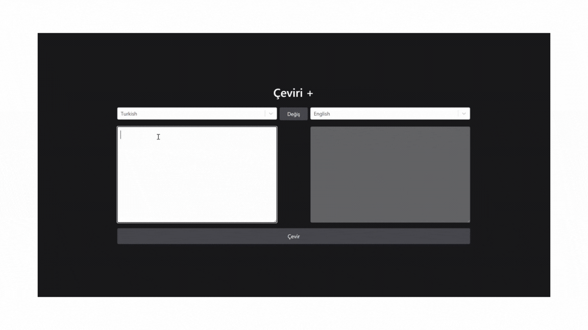

# Kütüphaneler

- axios
- @reduxjs/toolkit
- react-redux
- react-select
- tailwind

# Özellikler

- Dil Seçimi: Kullanıcılar, kaynak ve hedef diller arasından seçim yapabilir.
- Metin Çevirisi: Girilen metin, seçilen diller arasında çevrilebilir.
- Dinamik Dil Listesi: Desteklenen diller dinamik olarak bir API çağrısı ile elde edilir.
- Yükleniyor Gösterge: Çeviri işlemi sırasında bir yükleniyor göstergesi görünür.

